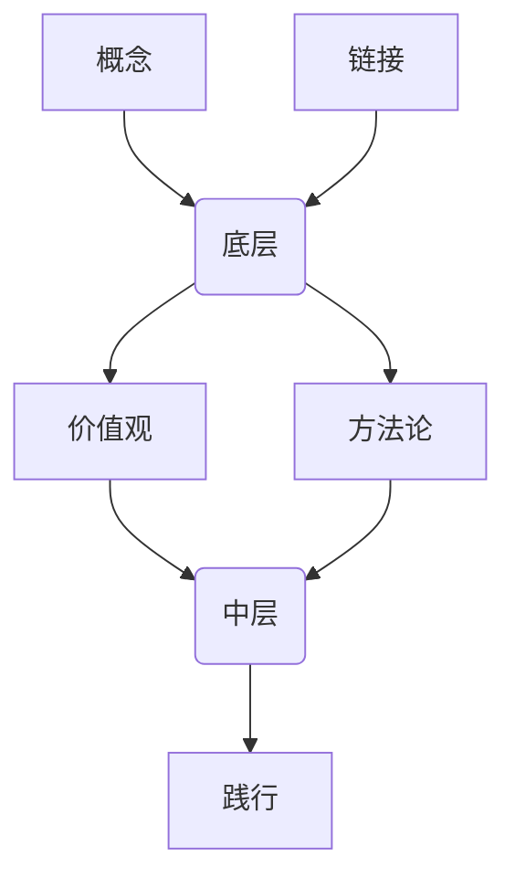

## 财富自由

* what
    * 不再为了满足生活必需而出卖子的时间了

* how
    * 出售的时间单价更高
    * 提升时间单价的方法，就是把原来的原本一份的时间，卖出更多份

#### 出售时间

* what
    * 获取财富
    * 获取能力

* why
    * 获得能力，才能获取更多的财富

* how：选择
    * 做的事情能完善自己哪些已有能力
    * 做的事情能获得什么新能力
    * 而不是我过去的能力是否用的上

#### 价值与估值

* what
    * 自己的能力增长是一条曲线
    * 市场对自己的估值是另一条曲线

* how
    * 关注价值，能力取消就是长期增长
    * 如果关注估值，就会去做提升估值的事，只是无根之水。
    * 不要让估值过分超过自己的价值，除非只做一次交易

## 注意力

* why
    * 时间不是你的，你只能和他做朋友，为你所用
    * 注意力才是你所拥有的最重要的、最宝贵的资源
    * 时间和注意力转瞬即逝，尽量不要把他们浪费在迅速贬值的信息上去

* what
    * 最宝贵的注意力一定要放在自己身上
    * 放在“成长”上

* how
    * 专注做事的时候，不该接受任何打扰
    * 回顾一下你昨天关注的事情都是哪些，罗列出来，判断一下，哪些东西和你有关，和你的成长有关吗
    * 回顾一下你上周关注的事情都是哪些，罗列出来，判断一下，哪些东西和你有关，和你的成长有关吗
    * 回顾一下你上个月关注的事情都是哪些，罗列出来，判断一下，哪些东西和你有关，和你的成长有关吗

## 付费

* why
    * 现在简单却长期成功的商业模式：把海量的廉价甚至免费的注意力集中起来高价卖掉。 
    * 之所以你的时间可以卖出去，就是因为总体上花钱买时间更划算。

* what
    * 凡事用钱买到的东西都是便宜的，凡事能用时间换来的注意力都是有价值的。

* how
    * 反思平时哪些注意力被贱卖了
    * 是否可以通过付费，花钱换取注意力
    * 

## 人生的枷锁

* why
    * 追求百分百的安全感，肯定会把自己困在永恒的当下
    * 我们必须放下一部分安全感，才能深入长期的观察、思考

* what
    * 合作的本质，是大家各自放弃一部分安全感，并把那一部分安全感交由合作方来保障。
    * 信任是什么，信任就是相信对方不会利用自己主动放弃的那一部分安全感。

* how
    * 很多时候尝试放弃一部分安全感，选择交给别人来完成
    * 自己放弃了部分安全感，就得到了更多的注意力

## 生活的根据

* why
    * 有的人，享受现在，活在当下的每分每秒
    * 有的人，放弃当下的享乐，去学习，去打拼
    * 这两种就是不同的生活方式

* what
    * 自己是为了当下的享受而活，还是为未来而活

* how
    * 预测未来是什么样子的，向着未来的样子努力
    * 用现在的资源换取未来的资源
    * 笃信自己的推理和判断
    * 扎实的推理和不断的拷问

#### 预测

* how
    1. 你对未来有个预测
    2. 那个预测需要多久能够得到结果
    3. 你笃定你的预测是准确的
    4. 于是你按照预测的结果行动、选择、思考
    5. 你终将走到那个结果出现的时刻
    6. 最终证明你的预测是正确的
    7. 按照未来的结果行动、选择和思考。于是，相当一段时间里，你活在未来。

## 贵人

* what
    * 求助是一种交易。一种展示自我价值的艺术
    * 贵人之所以愿意助你，因为他看到了你的价值。
    * 你如果是贵人，在你出手的那一刻，就得到了自然的回报。
    * 人际交往主要是价值交换

* how
    * 乐观的人更容易成为他们的贵人
    * 贵人更容易遇见贵人
    * 能帮助他人进步的才是真的贵人
    * 优秀的人，值得尊重的人更容易获得帮助
    * 乐于分享的人更容易获得帮助
    * 不给他们制造困难的人更容易获得帮助
    * 不耻与求助他们的人更容易获得帮助
    * 求助的时候不宜仅用金钱回报。帮助他人的时候不宜收取金钱回报。
    * 贵人不一定是牛人，牛人可能自顾自地牛。贵人都是以和为贵。
    * 很多时候，一个人的成功，是很多人希望他成功。如果所有人都不希望他成功，就很难成功。
    * 正在做正确的事情，更容易获得贵人相助
    * 活在未来的人更容易遇到贵人。
    * 世界上只有两种人，喜欢的和暂时未喜欢上的。别人都可能成为贵人

## 资本

* what
    * 资金的金额大小
    * 资金的使用时限
    * 资金背后的智慧
    
* how
    * 不要关注金额，关注盈亏比例
    * 给自己的投资款判上无期徒刑
    * 投资知识、经验、智慧，只能自己从实战中获得
    * 获取财富的诀窍是不冒险

## 落后

* what
    * 我们并不能感知整个世界，只能通过感知周边来判读自己处于什么水平
    * 那些成功的人，真的知道大家不知道的事情，不知道的方法。
    * 认知偏差，90%的司机度认为自己的水平在平均水平之上。
    * 这个世界时8/2原则，及格是没有用的，只有达到80分以上才有用。
    * 21世纪，1%后面都是落后
    * 那些优秀的人已经慢慢在你的世界里消失，你已经沦入落后的80%，还在盲目的在80里寻找差不多

* how
    * 长期持续，足以淘汰80%的竞争者。
    * 快要达到20%，差不多20%，其实很可能差很多。成长是线性增长的，越往后越难。
    * 破除差不多心态，最直接的方法就是先把一件事做到足够好

## 多维竞争

* what
    * 从单个维度上，大家比的是长度；两个维度上大家比的是面积；三个维度上大家比的是体积。
    * 奥运金牌的主，现在依然耳熟能详的，都是在自己曾经做的最好的维度之外。开拓了一个或者多个维度。
    * 每次跨界都是给自己增加新的维度
    * 多一个维度的技能，在团队，就多担任一个角色。
    * 一个人就是一个团体作战，拥有不同能力的团体

* why
    * 跨界成本越大，越有可能获得极大的利润
    * 每次跨界，就是给自己拓展一个新的维度

* how
    * 至少在一个维度上足够突出
    * 对新知识保持开放的态度

## 元认知能力

* what
    * 对自己思考过程的认知和理解
    * 智商、情商只是外在的表现。支撑他们的是思考方式

* why
    * 锻炼元认知和锻炼身体一样

* how
  * 冥想
  * 培养一个让自己全神贯注的兴趣：主动的全身关注而不是被动 
  * 反思

#### 冥想

* 从十五分钟起，把呼吸集中到呼吸上
* 身体坐正
* 呼吸均匀
* 一旦走神，重新集中到呼吸上即可

#### 反思

* 反思一下自己的思路和思考过程
* 反思一下自己的想法有没有逻辑谬误
* 反思自己的想法因何而来，为什么是这样思考的，受到了哪些因素的影响。
* 有没有其他思考的方法 

#### 兴趣

* 有兴趣
* 刻意练习
* 做的更好
* 更有兴趣
* 继续刻意练习

## 万能钥匙

* what 
    * 不要把注意力盯住问题，而是盯住解决方案

* why
    * 想要解决自己赚不了钱的问题，不要把注意力盯住赚钱，而是提升自己的能力
    * 人和人之间的差异，往往是一念之差，实际上的价值差异，却是整个世界。

## 坚持

* why
    * 为什么总是无法坚持下去

* what
    * 做真正的刚需

* how
    * 自己经常在目标和放弃间徘徊，是为什么
    * 经常回顾和总结，避免这种情况

## 这个世界

* why
    * 有些观念，你觉得跟自己有关，他也不一定起作用，但反过来，若你觉得与自己无关，那么它一定不会起作用

* what
    * 有时候，我们只是为了逃避困难而试着说服自己，这件事情和我没有什么关系

* how
    * 面对新知识，新观念的时候，不要先让“与我无关”的想法占据大脑，不妨先主动吸收，按照那个观点 去做一下。
    * 教是最好的学习方法
    * 你希望活着什么样的世界，就先按照那个世界应有的规则去行动。自然而然你就会向着那个世界靠拢，最终真的活在那个世界里。
    * 你身边的人对你的反应，其实是你在他们身上的投影

## 抱怨

* why
    * 不仅仅浪费时间，腐蚀你的好心情
    * 没有人喜欢听抱怨
    * 暴露 自己的无能，会让自己不由自己的放弃挣扎

* how
    * 能解决的就去解决（能力）
    * 不能解决的就承受（坚韧）
    * 刻意练习，意识到自己抱怨

## 别人的好

* what
    * 比较的大坑，通过比过比人获得满足感

* why
    * 别人眼中的好形象带来满足感，很好做
    * 自身进步带来满足感，很难做

* how
    * 注重自身的成长

## 正确的价值

|            | 别人都是正确的 | 别人都是错误的 |
| ---------- | -------------- | -------------- |
| 你是正确的 |                |                |
| 你是错误的 |                |                |

* what
    * 你正确的程度越大，与此同时，不认同你的人越多，这样的时候，价值才很大。
    * 如果你是正确的，所有人也都是正确的，价值几乎为0
    * 很多人衡量正确与否，靠的不是逻辑思考能力，靠的是“认同的人是否足够多”

* how
    * 听大多数人的话，参考少数人的意见，最终自己做决定
    * 特立独行且正确, 行动

## 命运

* what
    * 所谓成功，无非是解答题高手做对了选择题，用正确的方式去做了正确的事情
    * 即是解答题高手，又是选择题高手的时候，胜算才最大
    * 选择并不难，可能并不存在。所谓选择，知识价值观确定之后的自然结果
    * 价值观决定命运

* how
    * 打磨自己的原则，原则能够落实到选择上，有原则，选择的时候才不会不知所措。
    * 复盘评估自己的某个重要选择，看看那些价值观影响了选择
    * 若某个选择是错误的，那么根据选择（价值观）是哪方面自己”以偏概全“了？

## 自我驱动力

* how
  * 如果没有这项技能，那现在有什么事儿我根本做不好，根本没有机会
  * 进而，在将来会遇到什么困难，会失去什么机会
  * 如果我最终没有获取这项技能，我就跟哪些人一样的？他们的生活究竟有多么凄惨。
  * 如果真的想持久的做好一件事：在开始之前就为这件事情赋予重大的意义，甚至多重重大的意义。
  * 详尽一起办法去寻求拥有那项技能的人以及人群。尽量与他们共度大量的时间，如果没办法一对一交流，起码也要时刻关注他们。

## 刚需

* why
    * 你有什么样的刚需，决定了你会过什么样的生活

* what
  * 面对一个选择，罗列筛选条件
  * 每个条件重要性打分，1~5
  * 每个条件必要性打分，只有0和1
  * 第二天重复上面流程再做一次
  * 条件判断，是否为刚需

* how
  * 什么对我才是最重要的
  * （添加）（必要的）（条件）
  * 一定尽量醉倒只考虑不遗漏那些最必要条件

## 避险

* what
    * 投资的刚需是避险
    * 安全：将自己全军覆没的可能性降为零
    * 安全感：在追求一个完全确定性的未来，希望没有任何付出的情况下，能够有100%确定的收益

* how
    * 追求安全，不是安全感

* why
    * 安全第一
    * 成为专家
    * 看傻瓜们冒险，增加避险经验

#### 如何投资

* 锁定一个增长最为迅猛的领域，然后在那个领域里投资很多有可能超速藏张的初期企业
* 以期望得到最大化利益的同时，从概率上保证总体风险降低到最低

## 差异

* what
    * 最终资本量级的差异
    * 尊重那些排在自己之前的人财富和自己的差异，知道那些差异不是用钱的数值衡量的，而是弥补那个差异所用的时间。

## 机会

* why
    * 一个人最终获得多少财富，最重要的因素之一，是看他的分析能力，一个拥有分析能力的人，不论他的起点有多低，都有机会再次成功。

* what
    * 别人的需求，才是我的机会
* how
    * 他们真正的需求是什么，最需要的又是什么
    * 我是那个能满足他需求的人吗
    * 如果我能，有没有可能成为必需，如果我不能，我怎样才能
    * 这个需求有必要一定由我去满足需求吗
    * 未来需要的是什么，然后从现状开始就朝那个方向努力

#### 创业需求

* 创业方向，是否满足高频、刚需、大众市场
* 为什么满足
* 如果不满足的话，为什么无所谓

## 条件

* what
    * 投资这种事，真的不是等到有了钱才能投资，没有钱一样投资

* why
    * 投资三要素：智慧，时限，金钱
    * 核心是思考能力
    * 每一个思维漏洞都会决堤，资本越大，决堤效果越惊人

* how
    * 开始虚拟投资，关注的公司，加入投资1美元，每月记录一下数据，主要关注其比例

## 预测

* why
    * 预测的准确率超过50%才有意思，否则还不如跑硬币去决定
    * 只要准确率超过50%，长期来看一定是赚钱的

* what
    * 短期价格预测是不可能的
    * 长期价格预测是很可能的
    * 预测时间期限越长，预测难度越低
    * 股票市场短期是个投票机器，长期是个称重机

* how
    * 不要短期期望过高
    * 不要长期期望过低

## 贪婪和诱惑

* what
    * 自己能赚的更多吗

* why
    * 绝大多数所谓的贪婪，实际上是来自于无知，想要不属于自己的东西

* how
    * 必须确保买到在长期至少获得15%复合年华收益的股票

## 先发优势

* what
    * 早不是决定因素，做正确的事情，远比“早点开始做”更重要
    * 早出发的人未必能获得“先发优势”，但如果你永远不出发，所有的优势都是别人的
    * 但有一些知识之际有商业价值，越早知道越受益，这就是”知识的时间价值“

* why
    * 3%的风险投资机构夺取了整个行业95%的回报，智慧才是最重要的

* how
    * 认识到复利的价值
    * 资本有复利
    * 知识、思考也有复利

## 全部押上

* why
    * 要躲避的最大的风险：从此再无机会
    * 喜欢押上全部的人，归根到底是缺乏耐心的人

* what
    * 投资铁律：永远不要押上全部
    * 如果只有60%的胜率，投资总资产的20%就已经是押上全部了

* how
    * 只有100%的把握时，才鳄鱼押上全部，不然可能失去全部

#### 全部是多少

* f = [p * (b + a) - a] / b
    * f 合理下注占比
    * a 单次下注金额
    * b 下注a后赢的话拿到的净利
    * p 赢的概率

## 定投

* why
    * 在一定程度上，策略能弥补能力上的不足

* what
    * 关键在于成长性，未来时增长的
    * 收益 = 公司成长性 * 定投策略效用

* how
    * 做投资功课，判断公司的成长性
    * 制定定投策略

#### 定投策略

* 买
    * 买什么
    * 什么时候买
    * 怎么买
    * 买多少
* 卖
    * 达到什么指标卖
    * 怎么卖
    * 卖多少

#### 定投公式

* C3 = C2 * (1 + C1) + 1

## 长期

* why
    * 你越弱，你的长期越长
    * 可以刻意通过提高能力缩短长期的长度
    * 学习使人长寿,拥有更多自由的时间

* what
    * 投资翻倍的时间中期，翻倍再翻倍的时间是长期

* how
    * 投资重要秘密：除投资以外稳定收入来源，长期更短
    * 能力越强，长期越短
    * 使用正确策略，长期更短

#### 长期公式

* x = 72 / 年华符合收益率

## 双倍

* what
    * 同一份时间,一部分给老板，获得薪水
    * 一部分给自己，获得能力和成长
    * 工作和成长并联

* why
    * 不断成长的结果，就是终将被低估-这是必然
    * 当被过分低估时，就到了“该自己闯出一片天空”的时候

## 时间买卖

* what
    * 卖时间终将不划算，那就买时间终将划算
    * 同时给自己打工不如“彻底为自己打工”
    * 先当自己的老板，然后通过日积月累的成长，最终回去“成为别人老板”的资格
    * 就是有资格批量、合理地购买他人的时间，然后以适当的价格把时间的价值再卖出去

## 写作

* why
    * 想要获得财富自由，必须学会写作
    * 写作是“把自己的同一段时间重复销售很多次”的极少选择之一，也是相对来看最容易成为普通人起步的台阶之一
    * 持续写作是很可以是锻炼学习能力、思考能力、分析能力、沟通能力 最直接、最低成本的方式

* how
    * 我写的东西对别人有没有用
    * 对别人有多大用，如何做到最有用
    * 对多少人有用，如果做到对更多人有用
    * 在多长时间段，对别人有用，如果做到有用时间更长
    * 对别人有用的话，如果才能优雅地让人们回馈我

## 你的价格

* what
    * 究竟什么决定你的价格，怎么提高未来价值

* what
    * 决定价格的不是成本，而是需求，对别人有用

* how
    * 当我提“换位思考”时，换位的对象是整个世界，而不是某个人
    * 我对这个世界有用吗

## 选择

* what
    * 选择方法论：（添加）（必要）（条件）
    * 每添加一个条件，选项都会大幅度减少。

* how
    * 面对任何一个选择：拿出笔罗列筛选条件
    * 为每个条件重要性打分，而后重新排序，可以1-5分
    * 考虑每个事件的重要性，打分只有0和1，必要和不必要
    * 三十分钟内结果一目了然
    * 第二天再花30分钟过一遍，如果重要性较高，需要重复多次

## 成长率

* what
    * 满足温饱
    * 能够赚钱
    * 能够成长
    * 能够做到“成长率”不断提高的生意

## 提高成长率

* what
    * 升级自己的操作系统

* how
    * 学习学习再学习
    * 学习更多技能
    * 长期持续

## 知识

* what
    * 能够指导我们做出更好的决策
    * 可能为我们带来更好的结果
    * 繁衍出更多的知识
    * 体系化的知识，是更高级的知识。

* how
    * 学习更多知识
    * 不同知识节点的链接，节点越多，越容易建立链接
    * 只有博学的人才有融会贯通的能力

## 智商

* what
    * 看他的操作系统里有多少必要、正确、清晰的概念
    * 看他的操作系统里那些必要、正确、清晰的概念之间、有多少必要、正确、清晰的关联

* how
    * 通过训练和自我训练提升智商
    * 转换焦点

## 速成

* why
    * 起步时，最重要的是什么

* what
    * 尽快入门
    * 不断改进，反复练习
    * 尽快开始改进这个过程
    * 尽快度过这个过程
    * 重复是，从笨拙到达熟练境界的唯一通路

* how
    * 获得某项技能的时候，最快的时间摸清“最少必要知识”有哪些
    * 掌握最少必要知识
    * 注意力专注在改进智商

## 希望

* why
    * 生命中最重要的是什么，怎么让明天更好

* what
    * 观察能力、思考能力、同感能力、反思能力不是一天可以精通的

## 做到

* what
    * 你觉得一件时间难或者你不会，仅仅是因为你没做过或者看别人做过
    * 见到活人做过，非常重要

* how
    * 克服无知带来的恐惧感
    * 先从简单的模仿开始
    * 再坚持几天，再多看几遍
    * 陌生的东西慢慢熟悉，不懂的概念慢慢清晰

## 学习能力

* what
    * 能学会别人手把手教的东西
    * 能学会书本上教授的技能
    * 能学会没有人能教授的技能

* how
    * 这个技能点的重点在哪里
    * 做的好的人为什么能做好，为什么有人做不好
    * 还有哪些地方是可以改进的
    * 哪些刻意练习必不可缺

#### 阅读

* why
    * 速度、跳读、扫读，这不是效率，需要自己二次回来阅读
    * 阅读本身没有价值，有价值的是阅读后的思考，思考后的践行

* how
    * 分析作者思路，作者是如何一步步思考到结论的
    * 自己与作者思路的差异，自己应该做什么
    * 写作的根源是思考，为了提高思考质量，必须做什么
    

## 趋势判断

* why
    * 证明自己对未来判断的正确很难，没有及时反馈

* what
    * 周期，是理财投资活动中最重要的点
    * 世界上所有的投资都有周期
    * 真正的趋势常常需要在多个周期之后才能正式展现

* how
    * 判断趋势的时候，看至少两个周期
    * 听多数人的话，参考少数人的建议，最后自己做决定
    * 让自己的思考质量足以保证自己的行动不后悔。这才是成长的标志

## 镜像世界

* what
    * 成功 = 技能 + 运气
    * 技能 ==== 运气
    * 从左到右，运气从0到100%
    * 从左到右，技能从100%到0

* how
    * 判断事情是右侧世界还是左侧世界
    * 根据采用这个世界相应的策略

## 终极问题

* why
    * 什么最重要

* what
    * 什
* how 
    * 不断问自己：最重要的是什么
    * 主动思考、主动修正
    * 一旦找到”最重要的那个东西"，就开始拼命琢磨它
    * 不断重复上述过程。

## 原则

* why
    * 关键时刻为什么总是选错

* what
    * 价值观决定选择的质量
    * 方法论决定选择后行动的质量
* how
    * 采用不同的价值观研究同一事物
    * 分析不同价值观带来的不同选择，以及选择的后果
    * 通过比较，选择长期效果好的价值观
    * 沉淀为原则

## 提问 

* what
    * 和别人沟通，问他们什么不重要，他们问什么才重要

## 执行力

* what
    * 执行力指一个人是否清楚地知道怎么一步步做下去
    * 把事情想明白执行力就强

* how
    * 制定计划，列出所需的步骤
    * 用实际行动检验和修正计划
    * 锻炼元认知控制情绪，通过情绪长期生成直觉

## 个人商业模式

* why
    * 关注自己的时间，如果笃定未能能赚到更多的钱，现在费劲花时间攒下的钱，都是极小极小的钱。
    * 未来甚至可以忽略不计

* what
    * 一份时间出售一次
    * 一份时间出售多次
    * 购买别人的时间

#### 出售一次

* how
    * 提升时间单价
    * 同时为自己打工

#### 出售多次

* how
    * 满足别人的刚需
    * 内容制造

#### 创业投资

* what
    * 购买他人的时间，用更高的价格卖出去
    * 投资一级市场
    * 投资二级市场