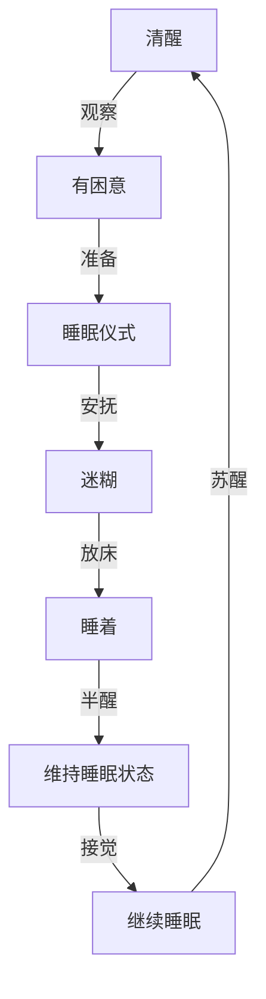

# 睡眠

## 睡眠模式和周期

### 成人睡眠模式和周期
 
* 非快速眼动睡眠
  * 1期：浅睡阶段
  * 2期：比较容易被唤醒
  * 3期：脑电波频率持续降低
  * 4期：深度睡眠
* 快速眼动睡眠
  * 眼球快速移动、肌肉抽动

| 睡眠阶段      | 占睡眠总时间比 | 状况                                                       |
| ------------- | -------------- | ---------------------------------------------------------- |
| 准备入睡      | ---            | 闭上眼睛，进入睡眠，心率下降、呼吸减慢                     |
| 非快速眼动1期 | 4%-5%          | 不对外界刺激响应，如果被叫醒会感觉自己没睡着               |
| 非快速眼动2期 | 45%-55%        | 进入正式睡眠的分水岭，如果被教学感觉自己已经睡着           |
| 非快速眼动3期 | 4%-6%          | 很难叫醒，身体机能恢复的主要阶段                           |
| 非快速眼动4期 | 12%-15%        | 深度睡眠，持续30分钟，流经大脑血液减少，肌肉增加，体力恢复 |
| 3期、2期      | 4%-6%          | 深睡眠后，睡眠变浅，恢复到3期和2期                         |
| 快速眼动期期  | 20%-25%        | 大脑活跃、开始做梦                                         |

* 上述各种睡眠阶段会循环出现4-6次

### 婴儿睡眠模式的特点

* 成人一个睡眠周期是90-100分钟，4个月左右婴儿的睡眠周期是30-50分钟。
* 睡眠状态分两种：安静睡眠和活动睡眠
 
| 睡眠阶段                     | 睡眠时间 |
| ---------------------------- | -------- |
| 由迷糊到入睡                 | 0-10分钟 |
| 逐渐睡深                     | 10-20分  |
| 深睡眠                       | 20-30分  |
| 从深度睡眠中逐渐苏醒         | 30-40分  |
| 睡眠周公其临近结束、易于醒来 | 40-50分  |

* 睡眠阶段随成长的变化

| 月龄        | 睡眠阶段                                                       |
| ----------- | -------------------------------------------------------------- |
| 0-3月       | 入睡后进入获得睡眠阶段，睡眠周期过半进入安静睡眠阶段           |
| 4-5月       | 入睡后进入安静睡觉阶段，活动睡眠比例下降到40%左右              |
| 6个月及以上 | 安静毁灭开始细分成不同的阶段，一个睡眠周期逐渐延长，趋向于成人 |

* 活动睡眠的比例

| 不同阶段        | 活动睡眠的比例 |
| --------------- | -------------- |
| 出生前10周      | 80%            |
| 早产4周的新生儿 | 65%            |
| 足月新生儿      | 50%            |
| 3个月婴儿       | 40%            |
| 3岁幼儿         | 30%            |
| 10岁儿童        | 25%            |

* 婴儿睡眠时间

| 不同阶段 | 睡眠市场  | 醒睡间隔    | 白天睡眠次数    |
| -------- | --------- | ----------- | --------------- |
| 0-3月    | 14-22小时 | 1-2小时     | 5-6次           |
| 3-6月    | 12-15小时 | 1.5-2.5小时 | 3-4次           |
| 6-9月    | 12-15小时 | 2-3小时     | 2次，黄昏觉消失 |
| 9-12月   | 12-15小时 | ---         | ---             |
| 12-18月  | 11-14小时 | ---         | 1次，上午觉小时 |

* 新生儿养成睡眠规律：4-6月是关键事情
* 比较理想的情况是：晚上7-9点入睡，次日6-8点醒来。

### 睡眠驱动力模型

* 醒的驱动力
  * 光线、声音的刺激
  * 身体不舒适
  * 不当的睡眠联想：比如醒时环境与入睡时相差很大
  * 生物钟导致的习惯性苏醒
* 睡的驱动力
  * 内力
    * 入睡能力
    * 入睡意愿
  * 外力
    * 拍
    * 抱
    * 喂奶

* 当外力一直存在，内力的发展可能受到制约。没有机会发展入睡能力的宝宝，睡眠需要的外力帮助可能会越来越多，入睡越来越困难。

## 哄睡

### 睡多少

* 如何判断宝宝是否缺觉
  * 玩耍时：莫名地发脾气、哭闹、吃手
  * 临睡：大脑、拼命揉眼睛吃手，已经很困了，但难以入睡，需要借助推车才能睡着。
  * 入睡方式：需要比较强的辅助才能入睡和维持睡眠状态，摇晃、奶睡等。
  * 睡眠期间：小睡时间特别短、常常只有20分钟，夜里醒很多次，且无法立即再入睡

* 美国国家睡眠基金会睡眠量建议

| 阶段   | 推荐睡眠量 | 可能也合适    | 不推荐          |
| ------ | ---------- | ------------- | --------------- |
| 0-3月  | 14-17小时  | 11-13，18-19  | 低于11， 高于19 |
| 4-11月 | 12-15小时  | 10-11， 16-18 | 低于10， 高于18 |
| 1-2岁  | 11-14小时  | 9-10，15-16   | 低于9， 高于16  |
| 3-5岁  | 10-13小时  | 8-9，14       | 低于8， 高于14  |

* 细化的睡眠参考

| 阶段      | 白天小睡次数 | 睡眠总量      |
| --------- | ------------ | ------------- |
| 1-3月     | 4-6次        | 14-17小时     |
| 4-6月     | 3-4次        | 13-15小时     |
| 7-9月     | 2-3次        | 12-14小时     |
| 10-15个月 | 1-2次        | 11.5-13.5小时 |
| 16-24个月 | 1            | 11-13小时     |

* 夜间进食情况的变化

| 阶段  | 连续睡眠时长 | 进食次数    |
| ----- | ------------ | ----------- |
| 1-3月 | 3-6小时      | 2-3次       |
| 4-6月 | 5-8小时      | 1-2次       |
| 7-9月 | 7-11小时     | 1次或者取消 |
| 1岁   | 9-12小时     | 不再进食    |

### 何时睡

* 睡前哭闹的主要原因：困

* 睡眠信号
  * 发脾气
  * 错过平时入睡点，宝宝会异常兴奋，且抗拒睡眠
  * 临睡前，啃咬的现象会加重
  * 吸引宝宝的注意力往往较难

* 入睡时机
  * 发现宝宝睡眠信号时，及时准备环境，哄睡。
  * 无法哄睡时、适时重启。尝试入睡时间超过20分钟或者半个小时，可以考虑暂时中止哄睡，等待时间，一般等待十几分钟或半个小时新的易睡窗口会出现
  
### 如何睡

* 宝宝昏昏欲睡却还没睡的时候，如果处于安静的状态，就把他放到床上。让他知道是在床上入睡的。
* 拍的作用是安抚情绪非非催眠，对于六个月i上的孩子，一直拍可能传递一种你怎么还不睡的烦躁感。
* 醒来不要立即逗玩：为了不打扰宝宝延续睡眠的可能性，也能避免宝宝潜意识期待醒来后的活动，想提前醒来和爸爸妈妈玩。

* 持续哭闹
  * 吸引视觉吸引力
  * 打哈欠会传染，大人可以在他面前打哈欠。

### 睡的好

* 怎么接觉
  * 醒来后行动：陈宝宝刚醒还迷糊时，拍拍甚至抱起
  * 提前行动:如果宝宝准时醒来，可以在醒前拍拍或者压住宝宝的手和肩部，甚至抱起来哄，把醒的迹象扑灭在摇篮里
  * 静观其变：给宝宝几分钟自己尝试的计划，看他是否可以重新睡着
* 接觉的原则
  * 刚开始，以宝宝能习惯睡长为目标
  * 作息稳定后，逐渐减少干预，避免过多介入变成帮倒忙

## 常见睡眠问题

### 多久能自主入睡

* 3个月的宝宝偶尔能自主入睡，4-6月是尝试自主入睡的时机，自主入睡也需要宝宝练习才能掌握，甚至练习的过程中还伴随着倒退
* 一直抱睡奶睡就没有办法学会自主入睡，要给宝宝机会学习睡觉。

### 放下就醒的问题

* 3个月内的婴儿，入睡后先进入20分钟左右的浅睡眠，从怀里挪动到床上容易醒。入睡20分钟进入深睡再放下或者直接在床上入睡更好。
* 3个月以后的婴儿，入睡后先进入深睡眠，放下时不要偷偷摸摸，坦然告知，让他知道放下了，不容易受到惊吓惊醒。

### 学会翻身知乎，夜里睡不好了

* 宝宝学会翻身，非常兴奋，会一遍遍确认复习，这种复习迫切感冲击大脑，容易出现梦中惊险、翻身抬头等受干扰额现象。
* 大运动发展期，白天要给足宝宝条件和时间联系，熟悉某种动作后，这种动作带来的刺激就减少了。
* 晚上发现翻身，应温和帮助宝宝复位，但不要过度干预，更不要一味采用喂奶的安抚方式来催睡。

### 生了场病后，就会夜醒很多次

* 一般时宝宝由于偶然的原因醒了，但受到喂奶、抱哄的干预，没有及时调整、就将主动醒的习惯固化下来。变成习惯性夜醒
* 习惯性夜醒的模式会延续相当长的时候，止盈采取相应的措施，改变原来的习惯，才能维护睡眠的完整性。

