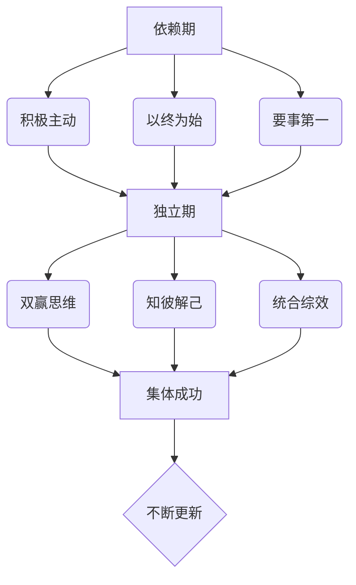

# 高效能人士的七个习惯

## 简述

* 高效能人士的七个习惯
    * 积极主动
    * 以终为始
    * 要事第一
    * 双赢思维
    * 知彼解己
    * 统合综效
    * 不断更新

* 成熟模式图

## 积极主动

* 是什么
    * 积极主动是面对刺激时，对外界的回应的形式
    * ABC，A是发生了事情，C是我的反应，B是自己对发生事情的态度，就是自己的世界观
    * 每个人都拥有选择的自由，意识可以控制自己的状态，只要自己不愿意，所有事情都不能让我愤怒。
    * 是一种选择的自由

* 怎么做
    * 减少消极的语言，用积极的语言
    * 更主动的行为
    * 在影响圈做事，减少关注圈，扩大影响圈
        * 减少关注圈：和自己的工作、学习、生活无关的事情，尽量降低关注度
        * 如何扩大影响圈：对身边的人敢于承诺与并信守承诺

* 如何做
    * 直接控制，影响圈，培养正确的习惯来解决。
    * 间接控制，扩大影响圈来解决
    * 无法控制，泰然处之

## 以终为始

* 是什么
    * 做任何事之前，先认清方向，这样才可以对目前的处境了如指掌，不至于在追求目标的过程中误入歧途。

* 如何做
    * 智力上的创造：想好如何做
    * 体力上的创造：想法付诸实践

## 要事第一

* 是什么
    * 把最重要的事放在第一位

* 怎么做：事情分类
    * 重要紧急
    * 重要不紧急
    * 紧急不重要
    * 不紧急不重要

* 如何做：
    * 第一类：尽快完成，尽力避免这类任务的出现
    * 第二类：机会型，面对未来，日常投入大量精力
    * 第三类：授权做
        * 指令性授权：做完告诉我结果
        * 责任性授权：增加参与感，压力转移
        * 授权考核：
            * 不成熟的人，目标不必定的太高，指示要详尽，提供充分的资源，频繁考核。
            * 成熟的人，分配挑战性高的事情，精简指令，减少考核的次数。
    * 第四类：不做

## 双赢思维

* 情感账户
    * 人际关系的本质是情感账户，余额越多，人际关系越融洽
    * 如何投资情感账户
        * 理解他人
        * 注意小节
        * 信守承诺
        * 明确期望
        * 正直诚信
        * 勇于致歉
        * 无条件的爱

* 人际关系的六种模式
    * 利人利己
    * 损人利己
    * 舍己为人
    * 两败俱伤
    * 独善其身
    * 好聚好散

* 如何做：长远来看，不是双赢，就是两败俱伤；不能双赢就好聚好散
    * 双赢品德
        * 诚信
        * 成熟：
            * 敢作敢为与善解人意间的平衡
            * 表达自己情感和信念的同时，体谅他人的想法和感受的能力
        * 知足
            * 富足的心态
            * 相信资源充足，人人有份。
    * 双赢关系
        * 以双赢品德为基础，才能维护双赢关系
        * 精髓是信用，即情感账户。
    * 双赢协议
        * 说明双赢的定义和方向
        * 让纵向交往变为水平交往，从属关系转位合作关系，上级监督转位自我监督。
        * 五要素
            * 确定目标和时限
            * 指导方针
            * 可用资源
            * 任务考核
            * 惩罚制度

## 知彼解己

* 是什么：
    * 先寻求去了解对方，再让对方了解自己。

* 如何做：
    * 避免自传性回应
        * 价值判断
        * 追根究底
        * 好为人师
        * 自以为是
    * 进行有效沟通
        * 第一阶段复述语句
        * 第二阶段加入解释，用自己的语言表达，左脑思维
        * 第三阶段渗入自己的感觉，右脑思维
        * 第四阶段，加以解释，并带有感情，左右脑并用。

* 注意要点
    * 移情倾听是有风险的，在影响对方之前，自己先被影响，这时自己是脆弱的。
    * 不要忘记自己沟通的目的。
    

## 统合综效

* 是什么
    * 如果一个相当聪明的人跟我意见不同，对方的主张必定有我尚未体会的奥妙
    * 如果两人意见相同，其中一人必属多余

* 如何做
    * 大家一起来把事情做好，调动大家的积极性。
    * 精髓在于判断和尊重差异，取长补短，敞开胸怀，博取众议。
    * 面对争议，寻求双赢的第三个方案

## 不断更新

* 是什么
    * 自我提升和完善

* 如何做
    * 身体：
        * 定期锻炼
        * 丰富营养
    * 精神
        * 优秀的文学作品
        * 优秀的音乐作品
        * 内心的安静
    * 智慧
        * 阅读
        * 写作
    * 社会/情感
        * 情感账户
        * 双赢思维
        * 统合综效

